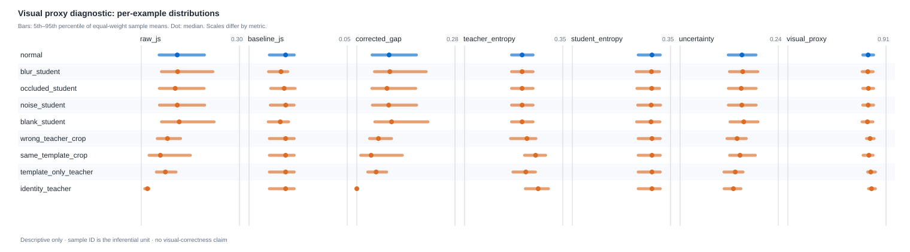
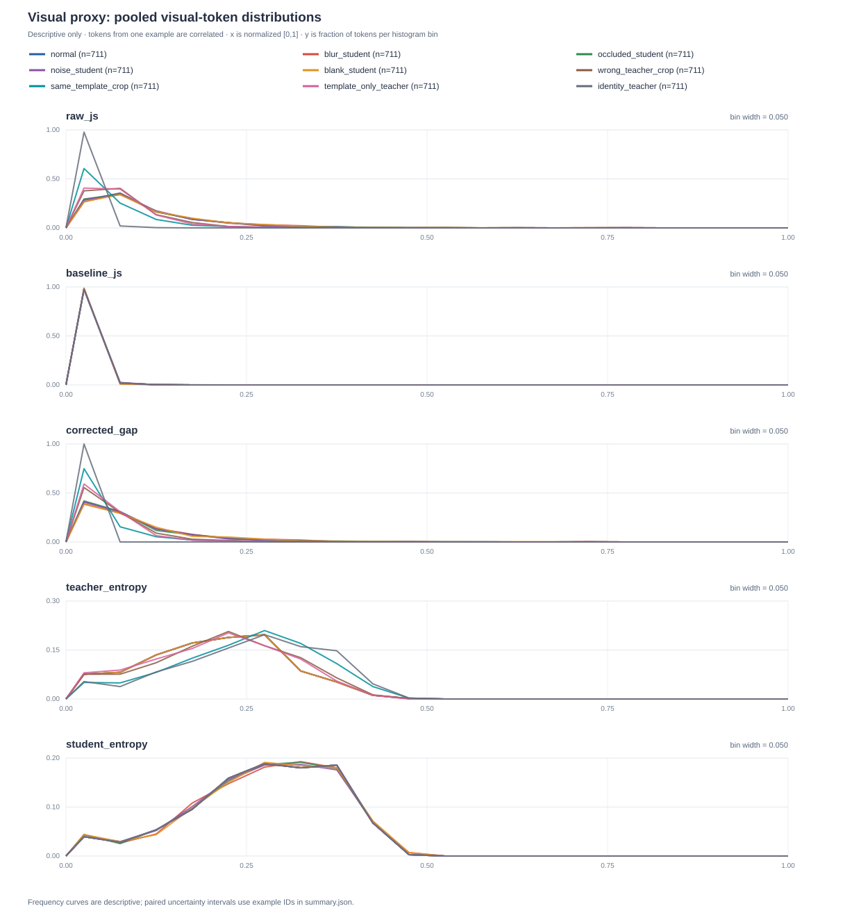

# Visual proxy diagnostic experiment — completed 2026-10-03

> 历史协议范围：本报告和冻结 tokenpack 使用未包含 `<reason>` 的旧输出模板。数值保留原样，不能作为当前 `vision-reason-answer-confidence-v2` 的诊断结果。重现本实验需要 checkout `5b39f18`（包含原提示词与脚本）；新脚本会拒绝旧协议 tokenpack，防止混用不同输入模板。

## 实测结论

已移除新增的仿射放大映射，保留原始代理公式。完成一次真实图像、真实 Qwen3.5-0.8B 前向的零更新诊断：100-step Student + `teacher_final` EMA Teacher，32 个冻结验证样本，9 个条件，共 288 个样本条件记录、6,399 个视觉 token 记录（每条件 711 个），评分前向 Student 160 次、Teacher 288 次。没有训练、反向传播或 EMA 更新，参数梯度数量为零。

固定最终 Student 新生成的原始 token IDs 和全部视觉位置，再在所有条件下评分。新生成文本与此前 step 100 验证记录 32/32 完全一致；正常条件代理与旧日志的最大绝对差为 2.60e-7。逐 token JS/熵聚合与训练函数、固定 token、样本计数和 identity 对照均通过校验。

受损条件沿用正常图生成的 token 做 teacher-forced 重打分，不重新生成答案，所以本次没有测受损图答案准确率。仅改变学生图的条件中，q+ 的图像、提示词与 prefix 不变，教师熵严格不变是设计结果。

### 教师与学生分布有差异，但代理的视觉响应不可靠

下表是每样本先求 token 均值，再对 32 个样本等权平均。JS 除以 ln(2)，熵除以 ln(词表大小)，代理分数为 `10*S`；不是模型口头报出的整数置信度。

| 条件 | 原始 JS | 基线 JS | 校正 d | 教师熵 H | 代理分数 /10 |
| --- | ---: | ---: | ---: | ---: | ---: |
| 正常原图 → 正确教师裁剪 | 0.1120 | 0.0176 | 0.0945 | 0.2035 | 7.430 |
| 学生图模糊到 16×16 后还原 | 0.1193 | 0.0159 | 0.1034 | 0.2035 | 7.365 |
| 学生图中心遮挡 25% 面积 | 0.1106 | 0.0176 | 0.0931 | 0.2035 | 7.439 |
| 学生图高斯噪声 σ=50 | 0.1127 | 0.0180 | 0.0948 | 0.2035 | 7.427 |
| 学生图全灰 | 0.1210 | 0.0156 | 0.1054 | 0.2035 | 7.350 |
| 教师裁剪换为其他场景 | 0.0795 | 0.0176 | 0.0620 | 0.2133 | 7.597 |
| 正确裁剪 + 学生提示词 | 0.0638 | 0.0176 | 0.0467 | 0.2480 | 7.453 |
| 完整原图 + 教师提示词 | 0.0721 | 0.0176 | 0.0545 | 0.2084 | 7.691 |
| q+ 与 q− 完全同输入 | 0.0176 | 0.0176 | 0.0000 | 0.2556 | 7.748 |

关键观察：

1. **真实分布差异存在。** 正常原始 JS=0.1120，明显高于同输入 EMA 基线 0.0176。正确裁剪配相同学生提示词时原始 JS=0.0638；完整原图配教师提示词时 JS=0.0721。图像变化和提示词/问题表述变化都贡献差异，不能把正常 JS 全部解释为视觉事实不确定性。
2. **全灰图的平均分只降 0.080/10。** 配对 95% bootstrap 区间为 [-0.127, -0.035]/10；模糊只降 0.065/10，区间 [-0.109, -0.025]/10。两者变化存在，但在此固定描述条件下幅度小。全灰后有 9/32 个样本的分数反而增加。
3. **教师跨场景错配让分数反升。** 26/32 个样本升分，平均 +0.168/10，区间 [+0.104, +0.236]/10。原始 JS 本身下降 0.0325，基线保持不变；教师熵上升 0.0098，未抵消差距下降。这一反向响应不能通过仿射放大修复，也不能归咎于基线扣除一个环节。
4. **提示词/问题表述会明显改变 JS 与熵。** 教师改用学生提示词且保持正确裁剪，d 降 0.0478，教师熵升 0.0446，最终 S 几乎抵消。这说明只看 S 分布会掩盖组成项的变化。
5. **中心遮挡与 σ=50 噪声的平均 S 变化区间覆盖零。** 不能宣称这两类条件产生了稳定下降。中心遮挡未保证覆盖红框目标；噪声强度也未保证破坏可辨认性。

正常条件的样本均值分布：d=0.09449±0.04161，P05–P95 为 0.04306–0.16764；教师熵=0.20349±0.02645，P05–P95 为 0.16524–0.24063；S=0.74295±0.03076。教师熵贡献约 68.3% 的平均不确定度，**该比例不是解释方差比例**。正常 token 中 d 被截为零的比例只有 0.98%，因此集中分数不能简单解释为大量下界截断。

逐 token 的正常条件分布（711 个相关 token，仅作描述）：

| 组成项 | P05 | 中位数 | P95 |
| --- | ---: | ---: | ---: |
| 原始 JS | 0.0122 | 0.0791 | 0.2534 |
| 基线 JS | 0.0020 | 0.0147 | 0.0415 |
| 校正 d_t | 0.0041 | 0.0611 | 0.2418 |
| 教师归一化熵 | 0.0310 | 0.2087 | 0.3604 |
| 学生归一化熵 | 0.0662 | 0.2842 | 0.4107 |

本次结果支持先审查视觉信号与提示词贡献，再讨论代理构造。尚未证明模型是否普遍忽视图像、实际视觉事实正确率或代理校准；没有依据据此选新超参数或新增放大映射。

### 分布与证据





- [完整统计、输入/权重 SHA、实际前向计数与完成记录](evidence/visual_proxy_diagnostic_v1.json)
- 服务器原始文件：`/data/LHJ/Sure-VL/outputs/visual-proxy-diagnostic-v1-20261003`。
- 本地原始文件与详细报告：`outputs/analysis/visual_proxy_diagnostic_v1/merged/`、`results/`，按仓库约定忽略在 Git 之外。
- 分布同时保留 token pooled 描述统计和样本均值统计。推断单位是 32 个样本 ID，5000 次配对 bootstrap，seed=42；未把 6399 个重复条件 token 当作独立样本。区间是逐比较区间，未作多重比较校正。
- 错配裁剪按冻结顺序选择不同官方场景、不同原图和教师图 SHA 的下一候选，缩放到当前正确裁剪尺寸；它是跨场景错配干预，缩放可能改变长宽比，不是逐事实标签。
- GPU1 两次完整模型迁移超时；小张量及 1/16/64 MiB 传输检查通过。最终两个分片均在 GPU0 完成。最大 allocated 显存约 6.66 GiB，实验结束两卡均空闲。环境由现有 `uv` 项目管理，没有修改服务器依赖。

### 复现

以下命令使用 `5b39f18` 中的源码和旧提示词；请在该 commit 的独立 checkout 中运行。

```bash
RUN=/data/LHJ/Sure-VL/outputs/visual-proxy-diagnostic-v1-20261003
MODEL=/data/LHJ/Sure-VL/outputs/qwen35-08b-grpo-visionopd-full-100step-wandb-v1
MANIFEST=/data/LHJ/Sure-VL/data/vision_opd_6k_full/validation.jsonl
# 每次复现给 tokenpack/output 选择新路径；脚本拒绝覆盖已有产物。
CUDA_VISIBLE_DEVICES=0 uv run --no-sync python scripts/run_visual_proxy_diagnostic.py prepare \
  --model "$MODEL" --manifest "$MANIFEST" --ids-file "$RUN/diagnostic_ids.json" \
  --tokenpack "$RUN/repro_tokenpack.jsonl" --output "$RUN/repro_prepare"
CUDA_VISIBLE_DEVICES=0 uv run --no-sync python scripts/run_visual_proxy_diagnostic.py score \
  --model "$MODEL" --teacher "$MODEL/teacher_final" --manifest "$MANIFEST" \
  --ids-file "$RUN/diagnostic_ids.json" --tokenpack "$RUN/repro_tokenpack.jsonl" \
  --output "$RUN/repro_score"
uv run --no-sync python scripts/analyze_visual_proxy_diagnostic.py \
  --input-dir "$RUN/repro_score" --output-dir "$RUN/repro_analysis"
```

## 预先固定的诊断设计

## Question

The current proxy is concentrated near 7–8/10 on valid held-out examples.
Before changing its scale, test what its token-level terms do when visual
evidence or the Teacher prompt changes. This experiment is a **zero-update
diagnostic**. It cannot establish factual visual accuracy or training gain.

## Controlled inputs

Freeze one model checkpoint, processor/template versions, example IDs, Student
sampled completion token IDs, generation seed, and the selected `<vision>`
token positions. Reuse those exact completion IDs under every condition; do
not decode and tokenize them again. The runner should record source hashes,
the model/checkpoint identity, input-image hashes, and optimizer/EMA counters
showing that no update occurred during the comparison.

Use `normal` as the reference. The intended interventions are:

| Condition | Change relative to `normal` | Diagnostic role |
| --- | --- | --- |
| `blur_student` | Downsample the Student view to 16×16, then resize back; use the same view for the baseline | Strong blur sensitivity |
| `occluded_student` | Replace the center 50% of Student image width and height with RGB 127; use the same view for the baseline | Local evidence removal |
| `noise_student` | Add clipped RGB Gaussian noise with sigma 50 using a frozen per-example seed derived from 1234; use the same view for the baseline | Noisy evidence sensitivity |
| `blank_student` | Blank only the Student view and matching baseline | Strong Student-evidence control |
| `wrong_teacher_crop` | Replace only the privileged Teacher crop with a different crop | Sensitivity to Teacher-image mismatch |
| `same_template_crop` | Use the privileged crop with the Student template | Estimate prompt-template contribution |
| `template_only_teacher` | Give the Teacher the full Student image with the Teacher prompt | Isolate the Teacher template without a crop |
| `identity_teacher` | Reuse the exact same cached Teacher logits for privileged and same-view paths | Exact cancellation control: raw JS equals baseline JS |

The runner must document the actual changed inputs for each condition. These
names are labels, not statistical assumptions. A wrong crop can be wrong in
different ways; select it by a frozen, label-blind rule and record its source.

At each visual token, capture normalized `raw_js` between Student and
privileged Teacher, normalized `baseline_js` between Student and same-view
Teacher, their **per-token clipped** `corrected_gap`, normalized privileged
Teacher entropy, and their weighted uncertainty. Keep optional Student
entropy separate. At each example and condition, capture vision-token count,
fallback status, proxy score, and the corresponding token-term means. The
active proxy rule is `S = exp(-mean(uncertainty) / tau_s)` on valid spans and
`S = 0` on fallback; do not apply spread gain in this diagnostic.

## Analysis unit and checks

`scripts/analyze_visual_proxy_diagnostic.py` reads `token_records.jsonl`
and `samples.jsonl` using `--input-dir` and writes `summary.json`, `report.md`,
`distribution.svg`, and `token_distributions.svg` under a new empty
`--output-dir`. The first SVG shows equal-weight per-example distributions;
the second shows pooled-token frequency curves for raw JS, baseline JS,
corrected gap, Teacher entropy, and Student entropy. It checks
that `(example_id, condition, token_index)` is unique, that tokens belong to
known sample rows, that visual-token indices and IDs are unchanged across
conditions for each example, and that token counts and recorded means agree
within an explicit numerical tolerance. It checks the per-token clipped gap,
uncertainty, valid proxy score, fallback zero, and the exact cancellation of
`identity_teacher`. A failed check stops analysis instead of silently dropping
rows. New condition names can be compared with `normal` without changing the
statistical method.

Show token-level distributions only as **descriptive** plots/tables. The
independent unit for paired inference is the example ID. For every condition,
compare the per-example means of `corrected_gap`, Teacher entropy, uncertainty,
Student entropy when available, raw and baseline JS, and `S` with the same ID
in `normal`. Report the number of paired IDs, mean
and median paired delta, positive/negative/zero counts, and a 95% bootstrap
interval for the mean delta by resampling paired IDs with a fixed seed. Keep
fallback transitions explicit. For token-term deltas, use pairs with valid
token measurements in both conditions; for `S`, show both all paired IDs and
valid-to-valid pairs. Never bootstrap tokens as independent observations.
Report the token fraction where the corrected gap is zero and where raw JS is
no larger than baseline JS, as descriptive quantities. On nonfallback `normal`
examples, report sample-level correlations among corrected gap, Teacher
entropy, and `S`, plus each term's mean contribution to uncertainty.

## Interpretation boundary

An expected sensitivity direction is useful only if the raw JS, baseline JS,
corrected gap, and entropy terms explain it. The same-view correction may
remove part of a Student-image perturbation, so a monotonic `S` shift is not
guaranteed. A prompt-template effect or a confident wrong crop can also
change `S` without changing factual correctness. If answer labels are
available, report them separately as context; these interventions keep one
sampled answer fixed and do not create new ground-truth visual labels.

The experiment is complete only with validated runner artifacts and this
paired analysis. A wider `S` distribution by itself is not a success
criterion and does not authorize changing the training proxy scale.
